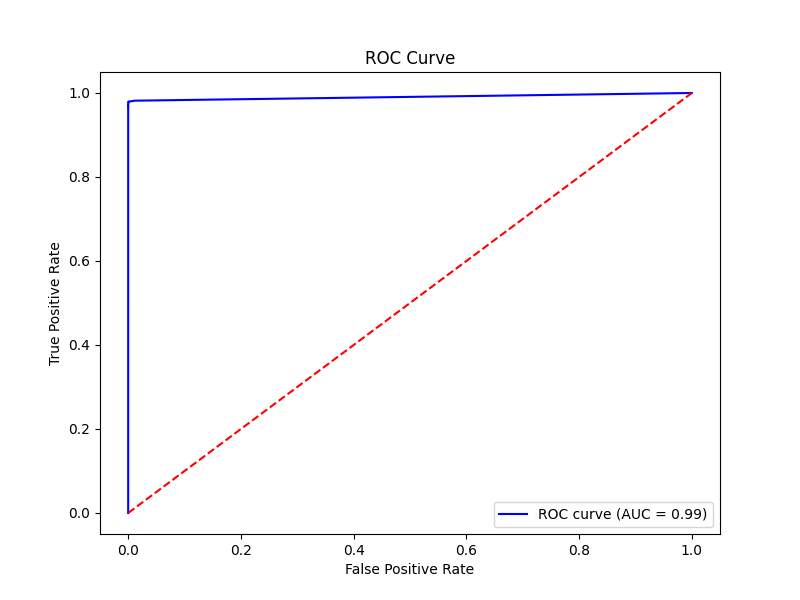

# Detección de Fraude en Transacciones Financieras

## 1. Resumen 

El sector fintech ha transformado radicalmente la forma en que los usuarios acceden y utilizan servicios financieros. Pagos digitales, transferencias instantáneas, billeteras electrónicas y crédito en línea son hoy servicios cotidianos. Sin embargo, este crecimiento ha venido acompañado de un reto crítico: el fraude en transacciones digitales.

Aunque las operaciones fraudulentas representan un porcentaje marginal del volumen total (≈0.1%), concentran hasta un 60% de las pérdidas financieras en algunas instituciones. El costo no es solo económico: cada transacción legítima bloqueada o cada falso positivo representa una fricción directa con el cliente, deteriora la experiencia, y puede desencadenar la pérdida de usuarios hacia competidores. En un mercado hipercompetitivo, la capacidad de diferenciarse por confianza, seguridad y experiencia fluida es vital.

Este proyecto aborda ese desafío mediante el desarrollo de un prototipo integral de detección de fraude en tiempo real, construido sobre una arquitectura modular y escalable. El sistema combina machine learning supervisado (Random Forest, XGBoost)** con técnicas de explicabilidad (SHAP), un pipeline de features estandarizado, un simulador de transacciones y un dashboard interactivo para analistas. Adicionalmente, se exploró el diseño de una Red Neuronal Artificial (RNA) implementada desde cero en NumPy, lo que permitió un control absoluto del flujo de datos, inicialización de pesos, funciones de activación y proceso de entrenamiento. Este ejercicio académico no solo afianzó el entendimiento profundo de los mecanismos internos de un modelo, sino que además sentó las bases para migrar hacia entornos productivos con tecnologías avanzadas.

En síntesis, el proyecto propone una solución que equilibra tres dimensiones críticas para las fintech:
- **Precisión predictiva**: detección efectiva de transacciones fraudulentas.  
- **Experiencia del cliente**: reducción de falsos positivos y menor fricción.  
- **Confiabilidad regulatoria**: modelos explicables y auditables.  

El impacto proyectado es significativo: reducción de pérdidas financieras, incremento en la confianza de los clientes, y cumplimiento regulatorio transparente.

---


## 2. Contexto de Negocio y Problema

En la economía digital, la confianza del cliente es el activo más importante. Para las fintech, mantener un balance adecuado entre seguridad y experiencia de usuario es un reto constante.  
Los principales problemas identificados son:

- **Alta concentración de pérdidas**: aunque las transacciones fraudulentas son escasas, las pérdidas económicas que generan son desproporcionadas.  
- **Falsos positivos**: los modelos tradicionales suelen ser conservadores, marcando como sospechosas operaciones legítimas. Esto degrada la experiencia del cliente y provoca deserción.  
- **Evolución del fraude**: los atacantes innovan constantemente. Un sistema estático pierde efectividad frente a nuevas modalidades.  
- **Exigencia regulatoria**: las instituciones deben demostrar que las decisiones automáticas son explicables y no discriminatorias.  

Frente a este escenario, una solución de detección de fraude en tiempo real, explicable y adaptable se convierte en una ventaja competitiva y estratégica.

---

## 3. Objetivos del Proyecto

El proyecto persigue cuatro objetivos estratégicos:

1. **Maximizar la detección de fraude** con modelos predictivos robustos y métricas adecuadas (ROC-AUC, PR-AUC, recall).  
2. **Minimizar la tasa de falsos positivos**, asegurando que clientes legítimos no sean penalizados innecesariamente.  
3. **Explicar las decisiones del modelo**, garantizando transparencia regulatoria y confianza por parte de clientes y auditores.  
4. **Construir un prototipo replicable y escalable**, capaz de integrarse en entornos productivos y evolucionar hacia nuevas técnicas (GNNs, autoencoders, aprendizaje online).  

---

## 4. Estructura del proyecto

La estructura del repositorio está diseñada para ser modular y escalable, facilitando la reproducibilidad de los experimentos y la organización de los componentes.

```
├── dashboard/
│       app.py
├── data/
│   │   creditcard.csv
│   └── processed/
│           creditcard_clean.csv
│           creditcard_ready.csv
├── models/
│   └── trained_models/
│           rf_model.pkl
│           xgb_model.pkl
├── notebooks/
│       data_cleaning.ipynb
│       evaluation.ipynb
│       exploratory.ipynb
│       modeling.ipynb
│       simulation.ipynb
└── src/
    │   utils.py
    │   visualization.py
    ├── features/
    │       feature_engineering.py
    ├── interpretability/
    │       shap_analysis.py
    ├── scoring/
    │      realtime.py
    │      simulator.py
    ├── tables/
    │       metrics_RandomForest.csv
    │       metrics_XGBoost.csv
    ├── visualization/
    │       confusion_matrix_RandomForest.png
    │       confusion_matrix_XGBoost.png
    │       correlation_matrix.png
    │       hist_amount.png
    │       pr_curve_RandomForest.png
    │       pr_curve_XGBoost.png
    │       roc_curve.png
    │       roc_curve_RandomForest.png
    │       roc_curve_XGBoost.png
    │   README.md
    │   requirements.txt
    └─  setup.py
```

---

## 5. Datos y Preparación

- **Dataset base**: Credit Card Fraud Detection (Kaggle).  
- **Procesamiento**:  
  - Tratamiento de valores nulos y outliers.  
  - Generación de variables derivadas como `Amount_log`.  
  - Normalización y partición de datos en entrenamiento y validación.  
- **Almacenamiento estructurado**:  
  - `data/` → datos originales.  
  - `data/processed` → datos limpios y listos para modelado.  

Esta estrategia asegura reproducibilidad y calidad en cada etapa.  

---

## 6. Metodologia del proyecto

### 6.1 Limpieza y Preparación de Datos  
En el notebook `data/`, se cargó el dataset de Credit Card Fraud Detection. Se trataron valores nulos y outliers, y se generaron variables derivadas como `Amount_log`.  
Los datos limpios se guardaron en `data/processed/creditcard_clean.csv`, que luego sirvieron como entrada para el modelado.  

Durante el proceso se generaron gráficos y tablas que muestran la distribución antes y después de la limpieza, almacenados en `src/visualization/`.  


### 6.2 Modelado de Machine Learning  
En `notebooks/modeling.ipynb` se entrenaron modelos de Random Forest y XGBoost, comparando sus métricas de desempeño como ROC-AUC y PR-AUC.  

Los modelos entrenados fueron almacenados en `models/trained_models/`.  
Los scripts de entrenamiento se encuentran en `src/models/train_models.py`.  

**Hallazgo principal:**  
XGBoost superó a Random Forest, mostrando mayor capacidad de detección de fraudes con menos falsos negativos.  


### 6.3 Evaluación de Modelos  
La evaluación se realizó en `notebooks/evaluation.ipynb`.  
Se calcularon:  
- Probabilidades de fraude  
- Curvas ROC y Precision-Recall  
- Matrices de confusión  
- Métricas comparativas  

Todas las figuras fueron guardadas en `src/visualization/`, asegurando trazabilidad de resultados.  


### 6.4 Pipeline de Feature Engineering  
El pipeline en `src/features/feature_engineering.py` asegura que las mismas transformaciones aplicadas en el entrenamiento se utilicen sobre nuevas transacciones.  

Esto garantiza consistencia y confiabilidad en el scoring y facilita la integración en sistemas de producción.  


### 6.5 Sistema de Scoring en Tiempo Real  
En `src/scoring/realtime.py` se implementó un sistema de scoring capaz de calcular la probabilidad de fraude para cada transacción.  

Se complementa con un simulador de transacciones (`src/scoring/simulator.py` y `notebooks/simulation.ipynb`), que permite probar el flujo completo con datos ficticios.  


### 6.6 Interpretabilidad con SHAP  
En `src/interpretability/shap_analysis.py` se aplicaron técnicas de SHAP values para explicar las predicciones.  

Los gráficos de summary plot muestran la importancia de cada variable en las decisiones del modelo, lo que aporta transparencia y cumplimiento regulatorio.  


### 6.7 Dashboard Interactivo  
Se construyó un [DASHBOARD](https://ueesiadeteccionfraudegrupo2-cjnrxbfkgmrzndypqfvtgk.streamlit.app/) en Streamlit que permite:  
- Subir archivos CSV de transacciones  
- Visualizar probabilidades de fraude  
- Mostrar curvas ROC y Precision-Recall  
- Explorar gráficas de importancia de variables con SHAP  

Este dashboard centraliza el análisis para analistas y responsables de seguridad financiera.

 


  


  


---


## 7. Resultados  

### 7.1 Distribución de Montos  
  

El histograma muestra que la mayoría de las transacciones tienen valores bajos, mientras que algunos outliers corresponden a montos altos, comúnmente asociados con fraudes.  
Esto motivó la creación de `Amount_log`.  

---

### 7.2 Matriz de Correlación  
  

Las variables presentan correlaciones bajas entre sí, lo cual favorece el aprendizaje de patrones complejos.  
La variable `Class` tiene poca correlación directa con atributos individuales, confirmando la necesidad de modelos avanzados.  

---

### 7.3 Matrices de Confusión  

- **Random Forest**  
  

- **XGBoost**  
  

XGBoost logró menos falsos negativos, siendo más efectivo en la reducción de pérdidas por fraudes no detectados.  

---

### 7.4 Curvas ROC  

- **ROC Random Forest**  
  

- **ROC XGBoost**  
  

- **ROC Comparativa**  
  

XGBoost obtuvo mejor trade-off entre sensibilidad y especificidad, con AUC ≈ 0.99 frente a 0.98 de Random Forest.  

---

### 7.5 Curvas Precision-Recall  

- **Random Forest**  
  

La curva PR muestra buen desempeño general (PR-AUC ≈ 0.94).  
El modelo de XGBoost (incluido en el repositorio) mantuvo un mejor equilibrio, confirmando su idoneidad en datasets desbalanceados.  

---

## 8. Conclusiones  

El desarrollo de este proyecto permitió demostrar cómo la integración de técnicas avanzadas de Machine Learning, pipelines reproducibles y herramientas de interpretabilidad puede generar un sistema robusto y escalable para la detección de fraudes en fintech.  

Los hallazgos clave se pueden resumir en los siguientes puntos:  

1. **XGBoost como modelo óptimo**  
   - Superó a Random Forest en métricas críticas como ROC-AUC, PR-AUC y reducción de falsos negativos.  
   - Garantiza un mejor balance entre sensibilidad y precisión, lo que resulta fundamental en contextos de alta desproporción entre transacciones legítimas y fraudulentas.  

2. **Minimización de pérdidas y protección del cliente**  
   - La reducción de falsos negativos implica menores pérdidas económicas directas.  
   - Al mismo tiempo, la disminución de falsos positivos protege la experiencia del cliente, evitando bloqueos innecesarios que podrían traducirse en desconfianza y fuga de usuarios.  

3. **Escalabilidad y consistencia del sistema**  
   - El pipeline de feature engineering asegura que los datos de nuevas transacciones se transformen de forma idéntica a los datos de entrenamiento, lo que permite escalar el sistema hacia entornos productivos sin pérdida de precisión.  

4. **Transparencia y cumplimiento regulatorio**  
   - La incorporación de explicabilidad mediante SHAP values ofrece trazabilidad en las decisiones del modelo, lo que es clave para auditorías y regulaciones en el sector financiero.  

5. **Adopción práctica con dashboard interactivo**  
   - El dashboard en Streamlit se convierte en una herramienta estratégica para los equipos de monitoreo, ya que centraliza la visualización de métricas, resultados y explicaciones de predicciones en tiempo real.  

---

### Conclusión General  

El sistema desarrollado representa un prototipo sólido de detección de fraude financiero en tiempo real, con la capacidad de equilibrar seguridad y experiencia de usuario.  
